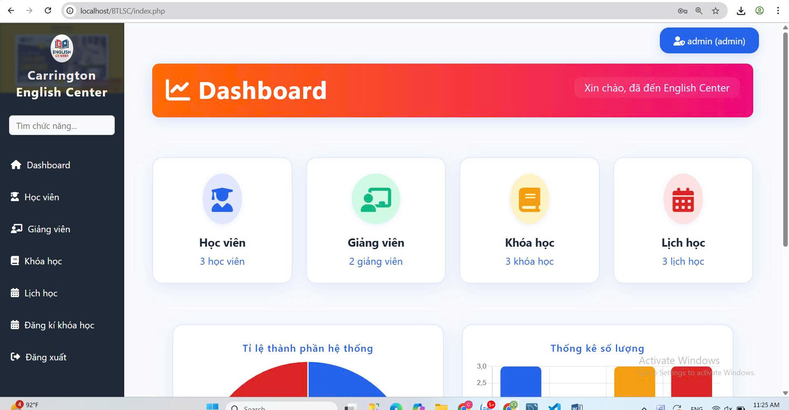
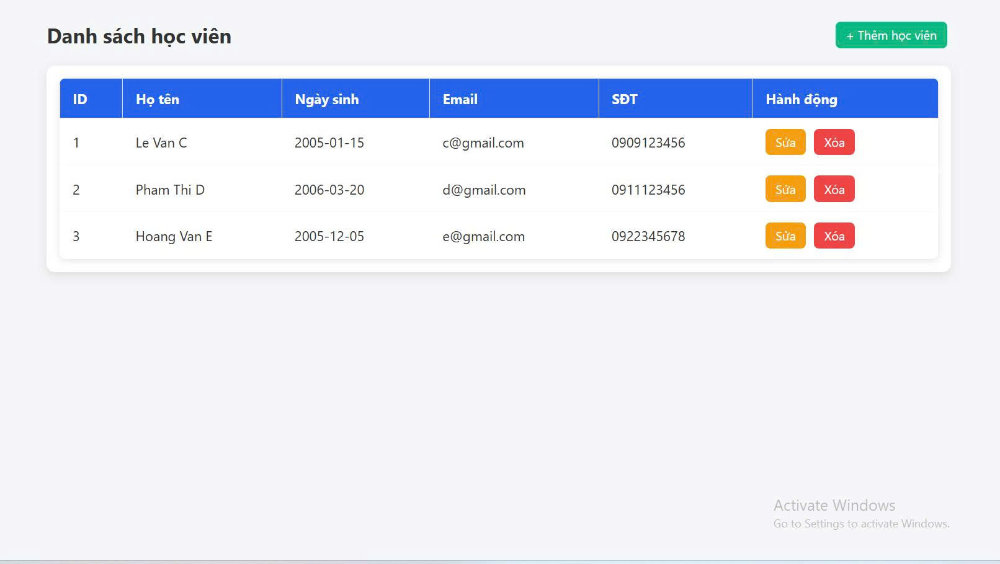
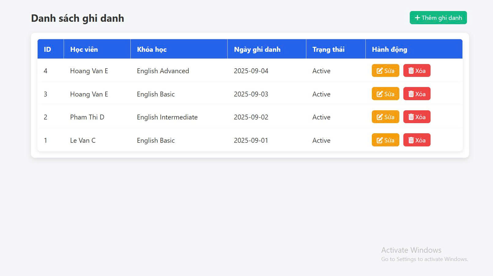

<h2 align="center">
    <a href="https://dainam.edu.vn/vi/khoa-cong-nghe-thong-tin">
    🎓 Faculty of Information Technology (DaiNam University)
    </a>
</h2>
<h2 align="center">
    PLATFORM ERP
</h2>
<div align="center">
    <p align="center">
        
        
        
    </p>

[](https://www.facebook.com/DNUAIoTLab)
[](https://dainam.edu.vn/vi/khoa-cong-nghe-thong-tin)
[](https://dainam.edu.vn)

</div>

## 📖 1. Giới thiệu
Đề tài được lựa chọn xuất phát từ nhu cầu thực tiễn trong việc quản lý tại các trung tâm tiếng Anh, nơi có khối lượng lớn thông tin cần được tổ chức và theo dõi như học viên, giảng viên, khóa học, lịch học và quá trình ghi danh. Việc quản lý thủ công dễ dẫn đến sai sót, tốn thời gian và làm giảm hiệu quả vận hành. Do đó, xây dựng một hệ thống quản lý số hóa, tích hợp và an toàn sẽ không chỉ hỗ trợ admin trong việc thêm, sửa, xóa dữ liệu mà còn giúp theo dõi tiến độ học tập, lịch giảng dạy một cách khoa học, đồng thời mang lại trải nghiệm tốt hơn cho học viên, phụ huynh và giáo viên. Đây cũng là giải pháp có tính mở rộng, phù hợp với xu hướng ứng dụng công nghệ trong giáo dục hiện nay.

## 🔧 2. Các công nghệ được sử dụng
<div align="center">

### Hệ điều hành
[](https://www.microsoft.com/en-us/windows/)
[](https://ubuntu.com/)
[](https://www.apple.com/macos/)

### Công nghệ chính
[](https://www.php.net/)
[](https://developer.mozilla.org/en-US/docs/Web/HTML)
[](https://developer.mozilla.org/en-US/docs/Web/CSS)
[](https://developer.mozilla.org/en-US/docs/Web/JavaScript)

### Web Server & Database
[](https://httpd.apache.org/)
[](https://www.mysql.com/)
[](https://www.apachefriends.org/)
[](https://dev.mysql.com/downloads/workbench/)

</div>

## ⚙️ 3. Cài đặt và Sử dụng

### 3.1. Yêu cầu hệ thống

- **Web Server**: Apache/Nginx
- **PHP**: Version 7.4 trở lên
- **Database**: MySQL 5.7+ hoặc MariaDB
- **XAMPP** (khuyến nghị cho Windows)
- **MySQL Workbench** (để quản lý database)
## 3.2 Hình ảnh web đã tạo
 <p align="center">
        
        
        
     
    </p>

## ⚙️ 4. Cài đặt

### 4.1. Cài đặt công cụ, môi trường và các thư viện cần thiết

#### 4.1.1. Tải project.
```
git clone https://gitlab.com/anhlta/odoo-fitdnu.git
```
#### 4.1.2. Cài đặt các thư viện cần thiết
Người sử dụng thực thi các lệnh sau đề cài đặt các thư viện cần thiết

```
sudo apt-get install libxml2-dev libxslt-dev libldap2-dev libsasl2-dev libssl-dev python3.10-distutils python3.10-dev build-essential libssl-dev libffi-dev zlib1g-dev python3.10-venv libpq-dev
```
#### 4.1.3. Khởi tạo môi trường ảo.
- Khởi tạo môi trường ảo
```
python3.10 -m venv ./venv
```
- Thay đổi trình thông dịch sang môi trường ảo
```
source venv/bin/activate
```
- Chạy requirements.txt để cài đặt tiếp các thư viện được yêu cầu
```
pip3 install -r requirements.txt
```
### 4.2. Setup database

Khởi tạo database trên docker bằng việc thực thi file dockercompose.yml.
```
sudo docker-compose up -d
```
### 4.3. Setup tham số chạy cho hệ thống
Tạo tệp **odoo.conf** có nội dung như sau:
```
[options]
addons_path = addons
db_host = localhost
db_password = odoo
db_user = odoo
db_port = 5431
xmlrpc_port = 8069
```
Có thể kế thừa từ file **odoo.conf.template**
### 4.4. Chạy hệ thống và cài đặt các ứng dụng cần thiết
Lệnh chạy
```
python3 odoo-bin.py -c odoo.conf -u all
```
Người sử dụng truy cập theo đường dẫn _http://localhost:8069/_ để đăng nhập vào hệ thống.

## 📝 5. License

© 2024 AIoTLab, Faculty of Information Technology, DaiNam University. All rights reserved.

---
