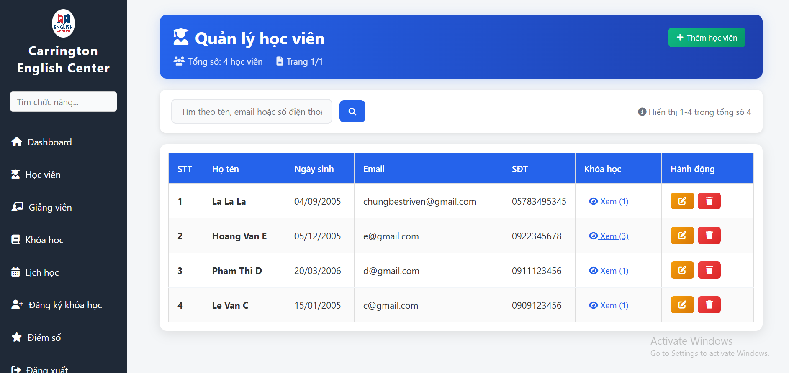
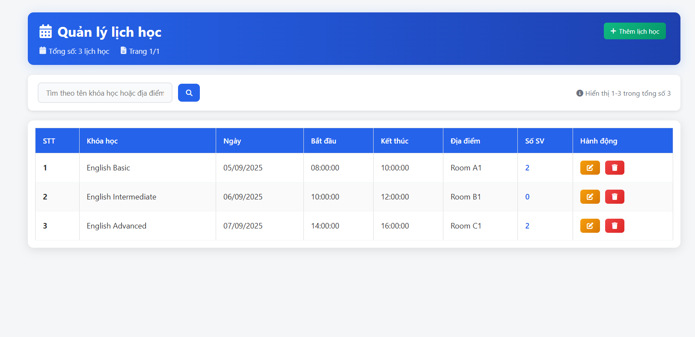
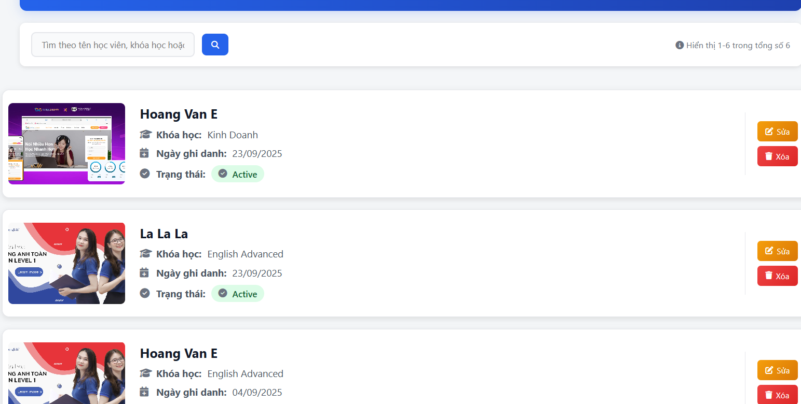
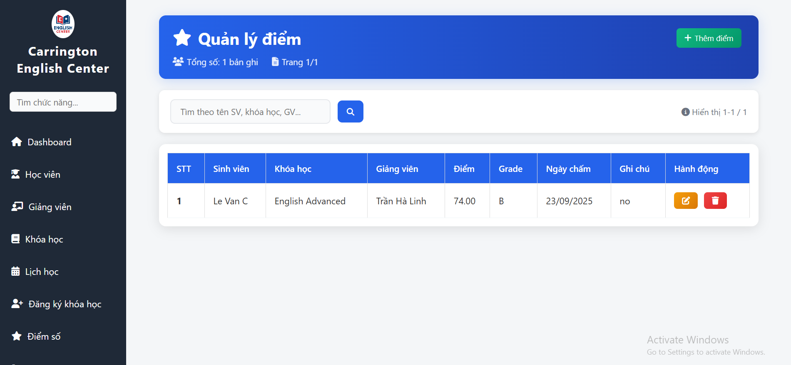

<h2 align="center">
    <a href="https://dainam.edu.vn/vi/khoa-cong-nghe-thong-tin">
    🎓 Faculty of Information Technology (DaiNam University)
    </a>
</h2>
<h2 align="center">
    PLATFORM ERP
</h2>
<div align="center">
    <p align="center">
        
        
        
    </p>

[](https://www.facebook.com/DNUAIoTLab)
[](https://dainam.edu.vn/vi/khoa-cong-nghe-thong-tin)
[](https://dainam.edu.vn)

</div>

## 📖 1. Giới thiệu
Đề tài được lựa chọn xuất phát từ nhu cầu thực tiễn trong việc quản lý tại các trung tâm tiếng Anh, nơi có khối lượng lớn thông tin cần được tổ chức và theo dõi như học viên, giảng viên, khóa học, lịch học và quá trình ghi danh. Việc quản lý thủ công dễ dẫn đến sai sót, tốn thời gian và làm giảm hiệu quả vận hành. Do đó, xây dựng một hệ thống quản lý số hóa, tích hợp và an toàn sẽ không chỉ hỗ trợ admin trong việc thêm, sửa, xóa dữ liệu mà còn giúp theo dõi tiến độ học tập, lịch giảng dạy một cách khoa học, đồng thời mang lại trải nghiệm tốt hơn cho học viên, phụ huynh và giáo viên. Đây cũng là giải pháp có tính mở rộng, phù hợp với xu hướng ứng dụng công nghệ trong giáo dục hiện nay.
Quản lý học viên (CRUD: thêm, sửa, xóa, xem danh sách) → liên quan bảng students

Quản lý giảng viên (CRUD) → liên quan bảng teachers

Quản lý khóa học (CRUD) → liên quan bảng courses

Quản lý lịch học (CRUD) → liên quan bảng schedules

Quản lý ghi danh (CRUD) → liên quan bảng enrollments

Quản lý sinh viên (CRUD) → liên quan bảng students

Quản lý báo cáo thống kê → liên quan bảng report_logs (tổng hợp từ nhiều bảng khác: payments, attendance, enrollments)

Đăng nhập/Đăng xuất → liên quan bảng users

Phân quyền người dùng → dựa trên cột role trong bảng users (admin, teacher, student)

Dashboard tổng quan → hiển thị thống kê: số lượng học viên, số khóa học, doanh thu, sever...

## 🔧 2. Các công nghệ được sử dụng
<div align="center">

### Hệ điều hành
[](https://www.microsoft.com/en-us/windows/)
[](https://ubuntu.com/)
[](https://www.apple.com/macos/)

### Công nghệ chính
[](https://www.php.net/)
[](https://developer.mozilla.org/en-US/docs/Web/HTML)
[](https://developer.mozilla.org/en-US/docs/Web/CSS)
[](https://developer.mozilla.org/en-US/docs/Web/JavaScript)

### Web Server & Database
[](https://httpd.apache.org/)
[](https://www.mysql.com/)
[](https://www.apachefriends.org/)
[](https://dev.mysql.com/downloads/workbench/)

</div>

## ⚙️ 3. Cài đặt và Sử dụng

### 3.1. Yêu cầu hệ thống

- **Web Server**: Apache/Nginx
- **PHP**: Version 7.4 trở lên
- **Database**: MySQL 5.7+ hoặc MariaDB
- **XAMPP** (khuyến nghị cho Windows)
- **MySQL Workbench** (để quản lý database)
## 3.2 Sử dụng hệ thống
 <p align="center">
###Dashboard      

### Trang xem danh sách sinh viên

### Trang xem danh sách giảng viên

### Trang xem khóa học

### Trang xem lịch học

### Trang xem đăng kí khóa học

### Trang xem điểm

     
    </p>

" />

## ⚙️ 4. Cài đặt

### 4.1. Cài đặt công cụ, môi trường và các thư viện cần thiết

- Tải và cài đặt **XAMPP**  
  👉 https://www.apachefriends.org/download.html  
  (Khuyến nghị bản XAMPP với PHP 8.x)

- Cài đặt **Visual Studio Code** và các extension:
  - PHP Intelephense  
  - MySQL  
  - Prettier – Code Formatter  
### 4.2. Tải project
Clone project về thư mục `htdocs` của XAMPP (ví dụ ổ C):

```bash
cd C:\xampp\htdocs
(https://github.com/chung445/Manguonmo_nhom9)
Truy cập project qua đường dẫn:
👉 https://github.com/chung445/Manguonmo_nhom9/index.php
```
### 4.3. Setup database
Mở XAMPP Control Panel, Start Apache và MySQL

Truy cập MySQL WorkBench
Tạo database:
```bash
CREATE DATABASE english_center;
USE english_center;

CREATE TABLE students (
    id INT AUTO_INCREMENT PRIMARY KEY,
    full_name VARCHAR(100) NOT NULL,
    dob DATE,
    email VARCHAR(100),
    phone VARCHAR(20),
    created_at TIMESTAMP DEFAULT CURRENT_TIMESTAMP
...
);
```

### 4.4. Setup tham số kết nối
Mở file config.php (hoặc .env) trong project, chỉnh thông tin DB:
```bash

<?php
    function getDbConnection() {
        $servername = "localhost";
        $username = "root";
        $password = "";
        $dbname = "english_center";
        $port = 3306;
$conn = mysqli_connect($servername, $username, $password, $dbname, $port);
        if (!$conn) {
            die("Kết nối database thất bại: " . mysqli_connect_error());
        }
        mysqli_set_charset($conn, "utf8");
        return $conn;
    }
?>
```
### 4.5. Chạy hệ thống
Mở XAMPP Control Panel → Start Apache và MySQL

Truy cập hệ thống:
👉 http://localhost/index.php

### 4.6. Đăng nhập lần đầu
Hệ thống có thể cấp tài khoản admin 

Sau khi đăng nhập Admin có thể:

Thêm sửa xóa sinh viên, giảng viên, khóa học, lịch học

Hiển thị Dashboard cho quản trị viên

Quản lý phân quyền theo cấp
